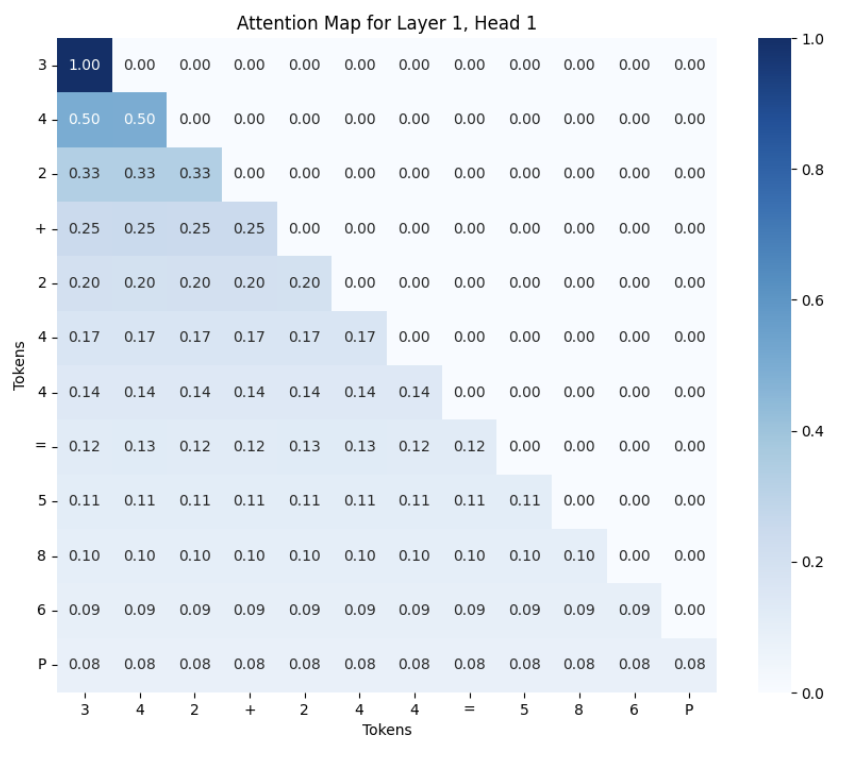

# transformermath

[](https://badge.fury.io/py/transformermath)

**transformermath** is a Python library designed to facilitate training GPT models on mathematical data using the next token prediction objective. This package supports a variety of functionalities including data generation for mathematical equations, model training, evaluation, and visualisation of embeddings and attention maps.

### 🔨 Setup

---

```python
pip install transformermath
```

### 🐍  Python Package Documentation

---

**Create data**

```python
# X,Y,equations,dataframe
trainX, trainY, train_items, train_data = transformermath.generate_addition_data(num_equations=100,n_digits=3,
maximum_sequence_length=16)

# in distribution data with train data items excluded
ID_X, ID_Y, ID_items, ID_data = transformermath.generate_addition_data(
                                            num_equations=100,
                                            n_digits=3,
                                            maximum_sequence_length=16,
                                            exclude_items=train_items)
                                            
# in distribution data with train data items excluded
# length = 4 (ID length = 3)
OOD_X, OOD_Y, OO_items, OOD_data = transformermath.generate_addition_data(
                                            num_equations=100,
                                            n_digits=4,
                                            maximum_sequence_length=16)
```

**Train model**

```python
models,losses = transformermath.train(X=ID_X,Y=ID_Y,epochs=50,
                      layers=2,heads=2,embd_dim=2)

# index most trained model
model = models[-1].model
```

**Evaluate model**

```python
# overall equation accuracy and data-point level accuracy
overall_acc, token_acc = transformermath.evaluate(model=model, evaluation_df=ID_data)
```

**Get internal representations**

```python
sequences, predictions, attention_weights, 
attention_outputs, block_outputs = transformermath.probe_encoded_representations(model=model, X=X)
```

**Visualise sequence embeddings**

```python
sequence_representation_data = transformermath.get_sequence_embedding_representations(layer_outputs=block_outputs, layer=0, sequences=sequences)

transformermath.visualise_sequence_embeddings(sequence_embeddings_data=sequence_representation_data,
                               label_category=0,
                               visualise_method="pca")
```


**Visualise token embeddings**

```python
token_representation_data = transformermath.get_token_embedding_representations(layer_outputs=block_outputs, layer=0, sequences=sequences)

transformermath.visualise_token_embeddings(token_embeddings_data=token_representation_data,
                               visualise_method="tsne")
```


**Tokenizer**

```python
tokenizer = transformermath.get_addition_tokenizer() 
```

**Display attention map**

```python
transformermath.display_attention_map(sequences=sequences, attention_weights=attention_weights,
                       layer=0, head=0, sequence_index=0, tokenizer=tokenizer)
```



**Display average attention map**

```python
display_average_attention_map(attention_weights=attention_weights,
                              layer=0, head=0, tokenizer=tokenizer)
```


**Display attention weight distribution** 

```python
display_attention_distributional_histogram(attention_weights_ID=attention_weights_ID,
                                          attention_weights_OOD=attention_weights_OOD,
                                            layer=0, head=0, tokenizer=tokenizer)

```


**Attention weight distribution difference tests**

```python
ks_statistic, ks_p_value, cosine_sim, energy_distance = perform_distributional_significance_tests(attention_weights_ID=attention_weights_OOD,
                                          attention_weights_OOD=attention_weights_ID,
                                          layer=0, head=0, tokenizer=tokenizer)
```

### Acknowledgements

This project was part of my undergraduate dissertation which built upon the prior work of my supervisor Dr Harish Tayyar Madabushi.

### References
- Project Guidance [Dr. Harish Tayyar Madabushi](https://github.com/H-TayyarMadabushi).

- minGPT by Andrej Karpathy. Available at: [GitHub - minGPT](https://github.com/karpathy/minGPT)

- Scikit-learn documentation for PCA. Available at: [scikit-learn.org](https://scikit-learn.org/stable/modules/generated/sklearn.decomposition.PCA.html)

- PCA visualization with Plotly. Available at: [plotly.com](https://plotly.com/python/pca-visualization/)

- UMAP plotting documentation. Available at: [umap-learn.readthedocs.io](https://umap-learn.readthedocs.io/en/latest/plotting.html)

- Trainer adapted. Available at: [Google Colab](https://colab.research.google.com/drive/1SiF0KZJp75rUeetKOWqpsA8clmHP6jMg?usp=sharing#scrollTo=xQmrWAhT6mkK)

- Energy distance documentation from SciPy. Available at: [docs.scipy.org](https://docs.scipy.org/doc/scipy/reference/generated/scipy.stats.energy_distance.html)

- Kolmogorov-Smirnov test documentation from SciPy. Available at: [docs.scipy.org](https://docs.scipy.org/doc/scipy/reference/generated/scipy.stats.ks_2samp.html)

- Cosine similarity documentation from SciPy. Available at: [docs.scipy.org](https://docs.scipy.org/doc/scipy/reference/generated/scipy.spatial.distance.cosine.html)


